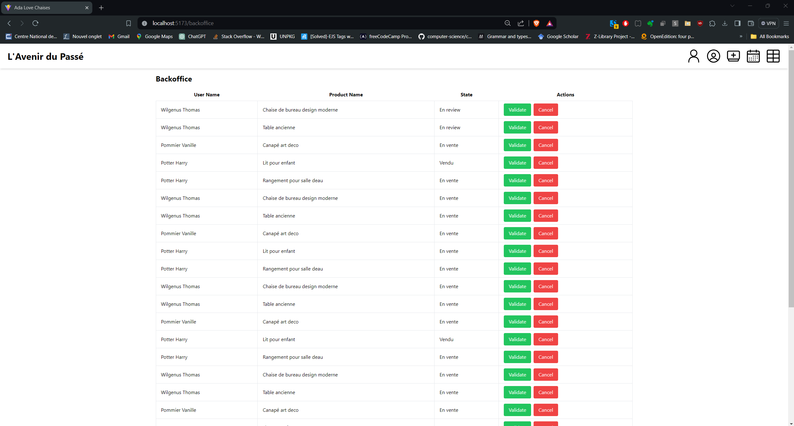

# FullStack e-commerce website (collective project)
An 8-person collaborative project formed two teams of 4 individuals each, dedicated to backend and frontend development. Completed within an 8-day timeframe, roles were rotated on the 4th day.


## Tech Stack :

* [Express](https://expressjs.com/) 
* [PostgreSQL](https://www.postgresql.org/)
* [pgAdmin](https://www.pgadmin.org/)
* [Postman](https://www.postman.com/)
* [React](https://react.dev/)
* [Typescript](https://www.typescriptlang.org/)
* [Tailwind CSS](https://tailwindcss.com/)
* [GitHub](https://github.com/)


## Features :

### Implemented

* Relational database with integrity constraints
* Integration between a relational database, en Express API and a React front
* Product list page
* Product details page
* Add product page 
* Admin dashboard page 
* Login page
* Register Page
* Product filter


### WIP

* User account page (my profile, my ads, my purchases)
* Update profile/password in user account
* Cart add/remove items
* Checkout, payment confirmation and payment successfull pages
* Posting a review on a saler account 
* Wishlist add/remove items
* Shipping info in session storage
* Sending mail to user when order are placed/processed/shiped
* Hashing password
* JSON web token 
* Admin : edit, cancel, validate newly added products
* Admin : list of orders made my users
* Admin : Update order status / delete order
* Admin : Delete user
* Admin : Stock management
* Admin : Sale management
* Admin : Messaging system / customer support chat to handle users inquiries and complaints 


### Installation

After downloading/cloning the repository code follow below steps:


#### - DataBase

- Install [PostgreSQL](https://www.postgresql.org/) 
- Install [pgAdmin4](https://www.pgadmin.org/) 
- Follow the instructions contained within the script `tables_db_lovechaise.sql` :

```
1. Download PostgreSQL (at least pgAdmin 4).
2. Run the installation file and set the password "postgres" for the default user "postgres".
3. Open pgAdmin.
4. Open the "Server" folder.
5. Enter the password "postgres" in the prompt.
6. Right-click on "Database" > Create > Database.
7. Name the database "Lovechaise" and save.
8. Right-click on the Lovechaise DB.
9. Click on "Query Tool".
10. Click on the "open file" button (folder icon).
11. Select and import the file tables_db_lovechaise.sql.
12. Click on the "Execute Script" button (play icon).
13. If needed to test queries: return to step 8.
```

### Back end

Move in folder `/Back-end` and run following commands : 

- Installing/updating Node dependencies : `npm install`
- Run : `npm run dev` /  `npm run start` 

### Front end

Move in folder `/Front-end` and run following commands : 

- Installing/updating Node dependencies : `npm install`
- Run : `npm run dev` /  `npm run start`





## Repository (origine)

[Ada tech School GitHub](https://github.com/adatechschool/projet-plateforme-de-vente-de-meubles-adalovechaises)

### Contributors

* **Clément Coadou**
* **Guillaume Depecker**
* **Marion Ochem**
* **Morgane Le MoaL** - [GitHub](https://github.com/M0nline) - [LinkedIn](https://www.linkedin.com/in/morganelemoal/)
* **Philippe Deslous-Paoli**
* **Tijana Laporte-Mitrovic** - [GitHub](https://github.com/Tiki102) - [LinkedIn](https://www.linkedin.com/in/tijana-laporte-mitrovic-b13859152/)
* **Zoé Lecaille**

With the support of Sofiane Khireddine and the mentors at Ada Tech School.


